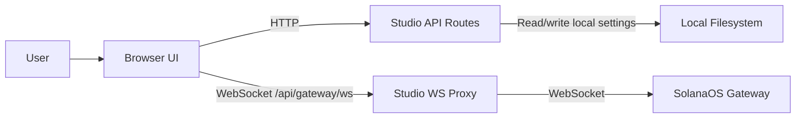

# Architecture

## Overview
Claw3D is a gateway-first Next.js application for visualizing and operating AI agents powered by SolanaOS using Three.JS framework.

It is the UI and proxy layer, not the SolanaOS runtime itself. SolanaOS remains the system of record for agents, sessions, and execution, while Claw3D provides:

- an `/agents` workspace for chat, approvals, settings, and runtime monitoring,
- an `/office` 3D environment for spatializing agent activity,
- an `/office/builder` surface for editing office layouts,
- a Studio-side settings and proxy layer that connects the browser to an upstream SolanaOS gateway.

## Goals
- Keep SolanaOS as the source of truth for runtime state.
- Keep local Studio state limited to UI preferences and connection settings.
- Support both local and remote gateway setups.
- Preserve clear boundaries between browser code, server code, and gateway-owned data.
- Favor feature-focused modules over large shared abstractions.

## Non-goals
- Multi-user or multi-tenant coordination.
- Replacing SolanaOS as the execution engine.
- Moving gateway-owned agent state into local frontend storage.

## System Model
Claw3D is split into four main parts:

1. Browser UI.
   The Next.js client renders the agents workspace, the office, and the builder.
2. Studio API routes.
   Server routes handle local settings and other server-only operations.
3. Studio WebSocket proxy.
   A custom Node server terminates browser WebSocket connections at `/api/gateway/ws` and forwards them to the upstream SolanaOS gateway.
4. SolanaOS gateway.
   The gateway owns agent records, sessions, config, approvals, and runtime events.

## Core Boundaries
### 1. Gateway-owned state
Agent records, sessions, approvals, runtime streams, and agent files belong to SolanaOS.

Claw3D may read and mutate that state through gateway APIs, but it should not create a competing local source of truth.

### 2. Studio-owned local state
Studio stores local settings such as:

- gateway URL and token,
- focused agent and related UI preferences,
- office layout and local presentation state.

These settings live under the local SolanaOS state directory and are accessed through server routes, not directly from the browser.

### 3. Client-server boundary
Client components should not read or write the local filesystem directly.

Anything that touches files, environment-backed settings, or SSH helpers belongs on the server side.

### 4. Browser-gateway boundary
The browser does not connect directly to the upstream gateway. It connects to Studio over a same-origin WebSocket, and Studio opens the upstream gateway connection on the server.

This keeps the upstream connection server-managed and makes local, remote, and tunneled setups easier to support. The current UI still loads the configured upstream URL/token into browser memory at runtime, so the browser remains part of the active trust boundary.

## Main Flows
### Connection flow
1. The UI loads Studio settings from `/api/studio`.
2. The browser opens a WebSocket to `/api/gateway/ws`.
3. The Studio proxy loads the upstream gateway URL and token server-side.
4. Studio opens the upstream gateway connection and forwards frames between browser and gateway.

### Agent runtime flow
1. The UI connects through the Studio proxy and requests gateway state.
2. Runtime events stream from the gateway into the agents UI.
3. The agents workspace derives chat, status, approvals, and summaries from that event stream.
4. The office view derives animation and room activity from the same underlying runtime signals.

### Office flow
1. The office subscribes to agent runtime state.
2. Event-trigger logic converts runtime activity into spatial cues.
3. The 3D scene renders agent movement, room activity, and temporary janitor/reset behavior from derived state.

## Repo Shape
- `src/app`: routes, layouts, and API endpoints.
- `src/features/agents`: agents workspace UI and agent-runtime state handling.
- `src/features/office`: office screens, panels, and builder UI.
- `src/features/retro-office`: 3D scene, navigation, actors, and rendering helpers.
- `src/lib`: gateway adapters, Studio settings, office derivation logic, and shared utilities.
- `server`: custom Studio server and WebSocket proxy.

For a practical contributor code map and extension guide, see `CODE_DOCUMENTATION.md`.

## Design Principles
- Gateway first.
  If data belongs to the runtime, it should live in SolanaOS, not in a local frontend file.
- Derived UI state over duplicated state.
  The UI should derive views from gateway events and local preferences instead of creating parallel records.
- Feature-first organization.
  Keep most UI logic inside feature modules and move only true shared utilities into `src/lib`.
- Narrow server boundaries.
  Filesystem access, SSH helpers, and token handling should stay on the server side.
- Stable architecture docs.
  This document should describe boundaries and intent, not every helper, hook, or workflow file.

## Important Decisions
- Local settings use a JSON-backed store rather than a database.
  This keeps the app simple and local-first, at the cost of multi-user support.
- Browser traffic goes through a same-origin Studio proxy rather than directly to the gateway.
  This adds one hop, but keeps credentials server-side and improves deployment flexibility.
- Agent configuration and files are managed through gateway APIs.
  This avoids drift between Claw3D and the upstream runtime.
- Office behavior is driven from derived event state rather than imperative scene mutations.
  This keeps the 3D layer more reproducible and testable.

## Constraints
- Do not store gateway tokens or secrets in client-side persistent storage.
- Do not read or write local files from client components.
- Do not add a second source of truth for agent records outside the gateway.
- Do not write gateway-owned agent config directly to local SolanaOS config files.
- Do not add parallel Studio settings endpoints when `/api/studio` already owns that responsibility.
- Do not add heavyweight abstractions without a clear need.

## Future Direction
- If multi-user support becomes important, replace the local settings store with a service-backed persistence layer and add authentication at the API boundary.
- If the gateway protocol changes, keep the impact isolated inside `src/lib/gateway` and the Studio proxy boundary.

See `KNOWN_ISSUES.md` for the current publication caveats and unresolved follow-up items.

## Diagram

